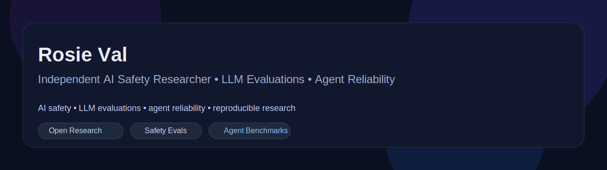

<p align="center">
  
</p>

<h1 align="center">Rosie Val</h1>
<p align="center"><b>Independent AI Safety Researcher • LLM Evaluations • Agent Reliability</b></p>

<p align="center">
  <a href="https://github.com/deathamongstlife">
    
  </a>
  <a href="https://dev.allyapp.cc">
    
  </a>
  <a href="mailto:admin@allyapp.cc">
    
  </a>
</p>

<p align="center">
  
  
  
  
</p>

## Overview

Independent researcher focused on practical AI safety, evaluation methodology, and reliability in language-model systems.

Current interests include:
- false completion and evidence-free success claims
- multi-step reliability and goal drift
- instruction conflict and uncertainty communication
- tooling and benchmark design for realistic workflows

## Featured Repositories

| Repository | Focus |
|---|---|
| [ai-safety-evals](https://github.com/deathamongstlife/ai-safety-evals) | Evaluation prompts, starter datasets, and scoring rubrics |
| [agent-reliability-bench](https://github.com/deathamongstlife/agent-reliability-bench) | Benchmark scaffolding for multi-step agent workflows |
| [research-notes](https://github.com/deathamongstlife/research-notes) | Logs, summaries, pilot notes, and research questions |
| [llm-tooling-experiments](https://github.com/deathamongstlife/llm-tooling-experiments) | Helper scripts and workflow experiments |
| [awesome-ai-safety-resources](https://github.com/deathamongstlife/awesome-ai-safety-resources) | Curated resource collection |
| [portfolio](https://github.com/deathamongstlife/portfolio) | Public research portfolio |

## Research Themes

```text
AI Safety
LLM Evaluation
Agent Reliability
Goal Drift
False Completion
Tool-Use Behavior
Alignment-Relevant Benchmarks
```

## GitHub Stats

<p align="center">
  
  
</p>

## Contact

Website: https://dev.allyapp.cc  
Email: admin@allyapp.cc  
Location: United States

<p align="center">
  <i>Building useful systems and documenting real model behavior.</i>
</p>
